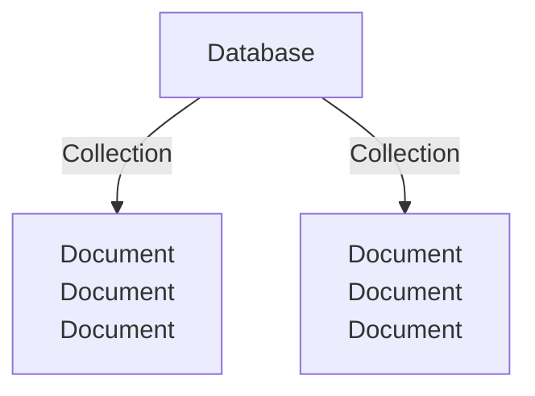

# Databases, collections, documents

---------------------

Показати всі бази даних

    show dbs

---

Створити базу даних та вибрати базу (однакова дія)

    use name

+ зробити якісь дії в базі, це збереже нову базу в памяті

створити запис в базу

    db.flightData.insertOne({code})

добавити елемент

    
    db.flightData.insertOne({  
    "departureAirport": "MUC",  
    "arrivalAirport": "SFO",  
    "aircraft": "Airbus A380",  
    "distance": 12000,  
    "intercontinental": true 
    })

